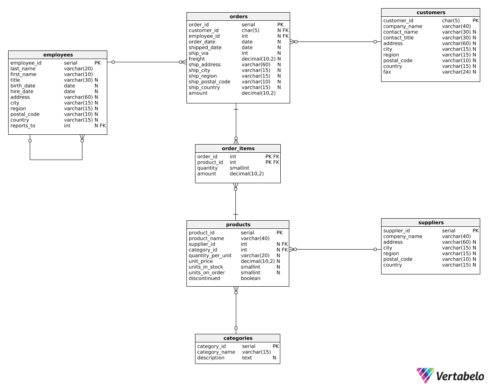

# Revenue Trend Analysis Using PostgreSQL

## Overview

- **Description:** Financial performance analysis is critical for businesses to drive strategic success. Here are designed and implemented a PostgreSQL-based revenue trend analysis to process large-scale transactional data, uncover seasonal trends, and deliver actionable insights. Leveraging advanced SQL techniques—`window functions`, `CTEs`, and `query optimization`—the project analyzed key metrics like YoY growth and rolling averages, enabling data-driven decision-making.
  
- **Objective:** To demonstrate PostgreSQL proficiency by developing optimized SQL queries for revenue trend analysis, delivering time-series insights, and addressing complex business challenges.
  
- **Context:** Simulated a high-volume e-commerce dataset with millions of transactions to mimic production-scale challenges.

## Tools and Technologies
- PostgreSQL

## Key Features

- **Advanced Trend Analysis**: Calculated monthly, quarterly, and year-over-year revenue metrics, including YoY growth, month-over-month changes, and rolling averages, using window functions and CTEs for efficient time-series analysis.
- **Scalable Revenue Aggregation**: Computed total, year-to-date, and month-to-date revenue across product categories, optimized for large-scale datasets with indexing and table partitioning.
- **Comparative Insights**: Analyzed revenue performance across timeframes (e.g., quarters, years) and categories, supporting strategic budgeting and performance benchmarking.

## Methodology

- **Data Source:** Worked with [Northwind Database](https://github.com/Microsoft/sql-server-samples/tree/master/samples/databases/northwind-pubs) 
    
    (`employees`, `customers`, `products`, `categories`, `suppliers`, `orders`, `order_items`)

    

- **Steps:**
   1. Designed SQL queries to aggregate revenue by time periods (e.g., monthly, quarterly).
   2. Used window functions (e.g., `LAG`, `SUM OVER`) to compute growth rates and trends.
   3. Aggregated revenue by month, quarter, and year using `DATE_TRUNC`, `EXTRACT` 
   4. Analyzed results to identify key patterns, such as peak sales months or declining trends.

---

## SQL Queries

Here is all SQL queries:

- [Computing total revenue for different time periods](https://github.com/hajarshu/sql-dojo/blob/main/revenue-trend-analysis/basic-revenue-metrics)

- [Comparing revenue across different periods](https://github.com/hajarshu/sql-dojo/blob/main/revenue-trend-analysis/revenue-across-different-period)

- [Comparing revenue over time across different categories](https://github.com/hajarshu/sql-dojo/blob/main/revenue-trend-analysis/revenue-over-time-across-different-categories)

